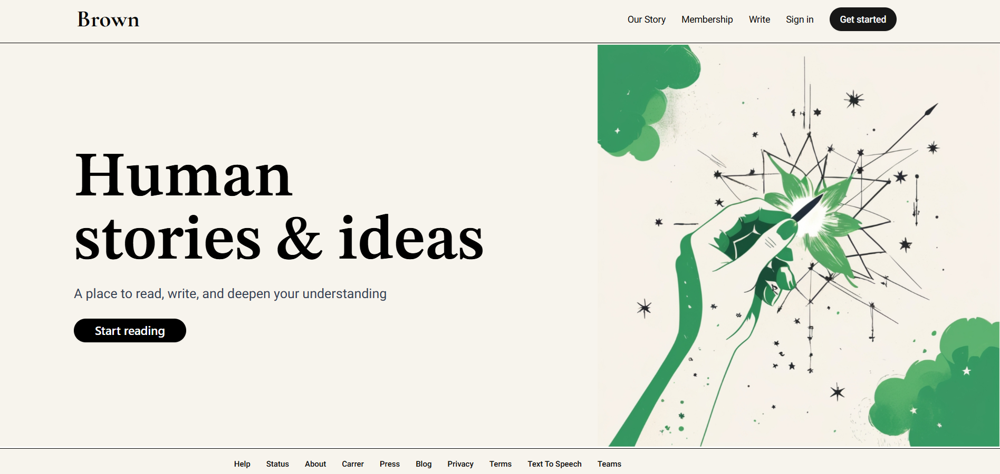
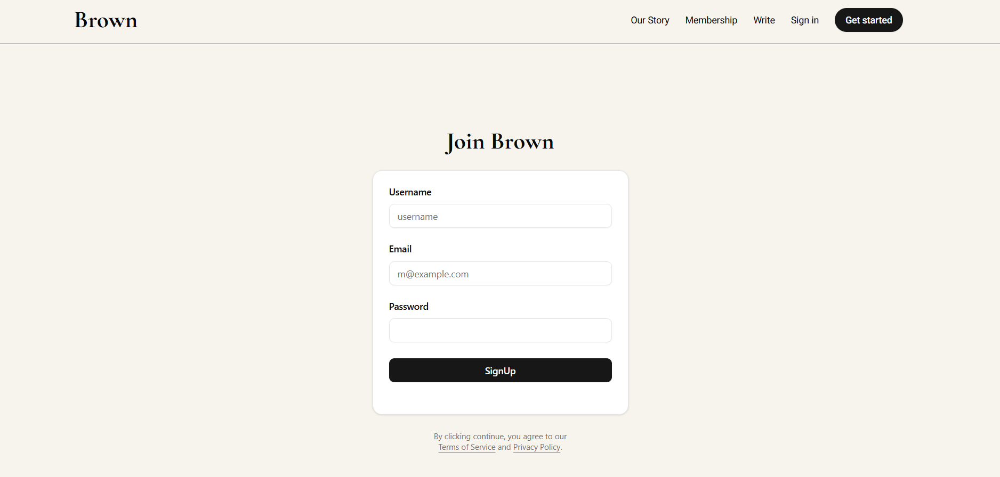
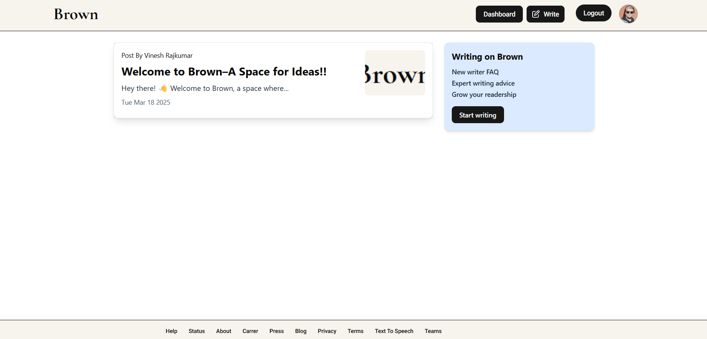
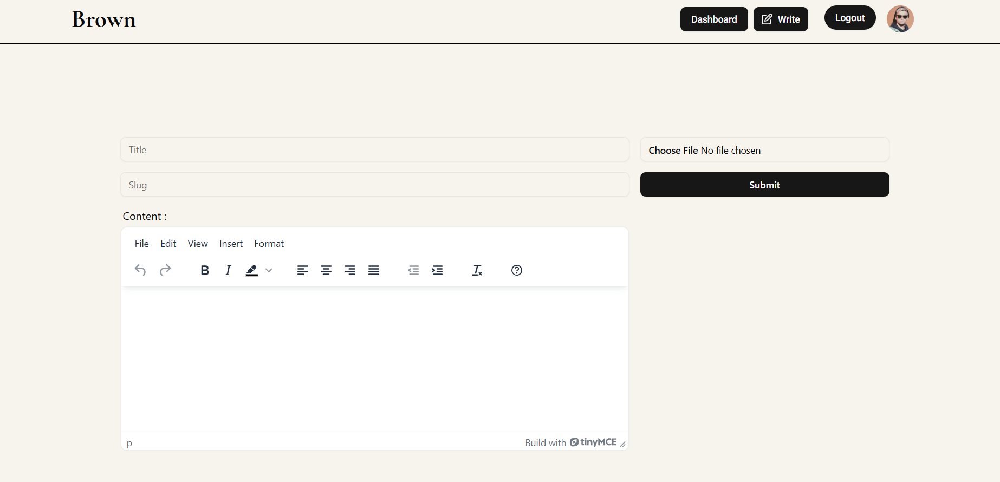
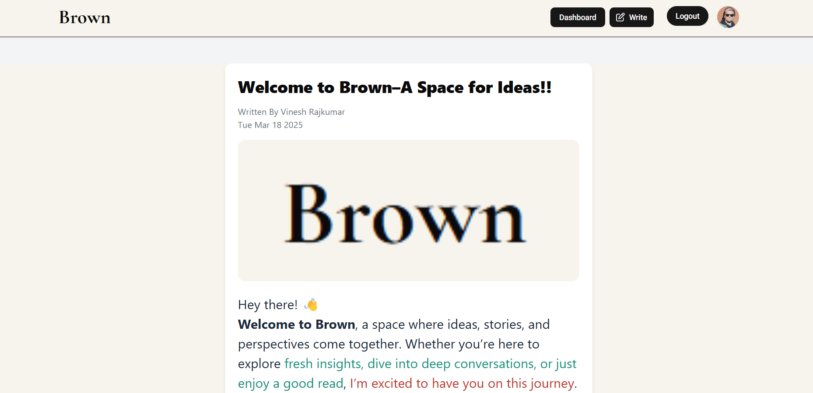
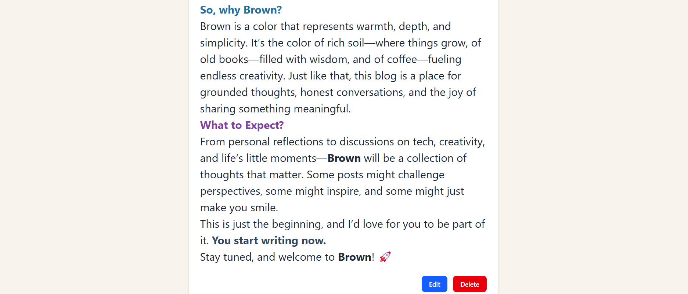
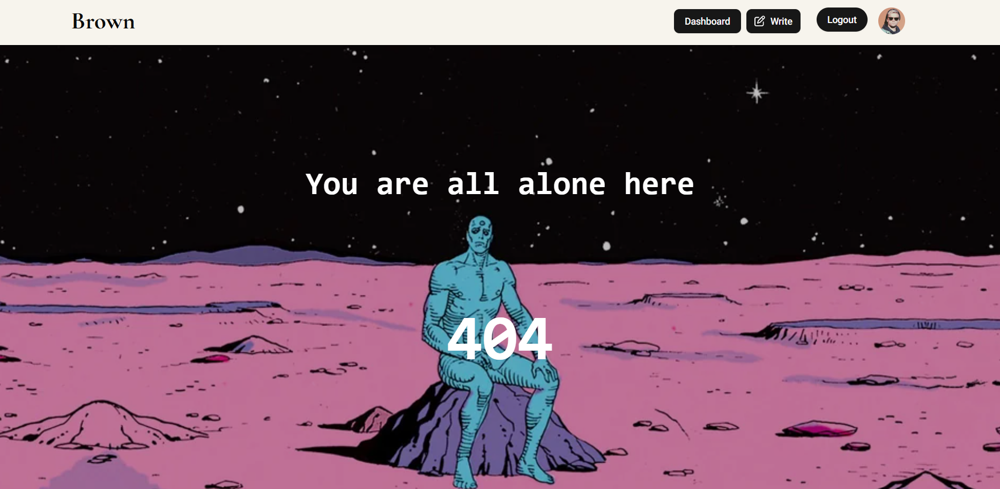

# The Brown Blog Site

## Introduction
The-Brown-Blog-Site is a modern blog application built with **React, Redux, and Appwrite (Backend as a Service)**. It allows users to **sign up, log in, create posts, and manage their content** efficiently.

## Features
- User authentication (Sign up & Log in)
- Create, update, and delete posts
- Secure data handling using Appwrite
- Responsive design for a seamless experience

## Screenshots








## Technology Stack

- **Frontend:** Redux, Vite React
- **Backend:** Appwrite (Backend as a Service)
- **State Management:** Redux Toolkit
- **Styling:** Tailwind CSS, Tailwind Merge, Tailwind CSS Animate
- **UI Components:** ShadCN Kit, Radix UI
- **Form Handling:** React Hook Form
- **Icons & UI Enhancements:** Lucide React, React Icons
- **Rich Text Editor:** TinyMCE React
- **Routing & Navigation:** React Router DOM
- **Notifications & Alerts:** Sonner
- **HTML Parsing:** HTML React Parser, DOM Parser React

## What I Learned

During the development of **The-Brown-Blog-Site**, I learned:

- How to integrate **Appwrite** for backend services.
- Managing state efficiently using **Redux Toolkit**.
- Structuring a React project for scalability.
- Using **Radix UI** and **ShadCN Kit** for enhanced UI components in Javascript.
- Integrating **TinyMCE** for rich text editing.
- Parsing and rendering HTML content dynamically with **HTML React Parser**.

## Installation
### 1. Clone the repository:
```sh
git clone https://github.com/VineshRajkumar/The-Brown-Blog-Site.git
cd The-Brown-Blog-Site
```

### 2. Install dependencies:
```sh
npm install
```

### 3. Set up environment variables:
Create a **.env** file in the root directory and add your Appwrite credentials:
```sh
VITE_APPWRITE_URL="https://cloud.appwrite.io/v1"
VITE_APPWRITE_PROJECT_ID="your_project_id"
VITE_APPWRITE_DATABASE_ID="your_database_id"
VITE_APPWRITE_COLLECTION_ID="your_collection_id"
VITE_APPWRITE_BUCKET_ID="your_bucket_id"
VITE_APPWRITE_API_KEY="your_appwrite_api_key"
VITE_TINY_MCE_API_KEY="your_tiny_mce_api_key"
```

### 4. Start the development server:
```sh
npm run dev
```

## Usage
1. Open **http://localhost:3000** in your browser.
2. Sign up for a new account or log in with existing credentials.
3. Create, edit, or delete blog posts.

## Author
**Vinesh Rajkumar**
